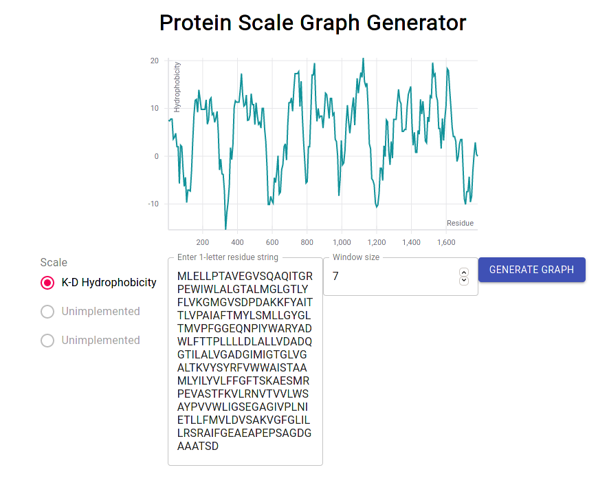

# Protein Scale Graph Generator 

Janky app to generate protein scale graphs, and probably more stuff later.\
Feel free to PR.

## Features:
- Runs in Browser/ Static Site
- Change average window size
- Not much else really...

## Feature Backlog:
- Responsive Graphs
- Interactive Graphs
- Graph Export
- Data Export
- Scales other than K-D Hydrophobicity
- Integration with UniProt, etc
- File "Upload"
- Webassembly and SIMD/ C bindings (might require architechtural change)

Live @ [https://kittywantsbacon.github.io/ProteinScale/](https://kittywants\bacon.github.io/ProteinScale/)

## Available Scripts

In the project directory, you can run:

### `yarn start`

Runs the app in the development mode at [http://localhost:3000](http://localhost:3000).

### `yarn test`

Launches the test runner in the interactive watch mode.

### `yarn build`

Builds the app for production to the `build` folder.

### `yarn eject`

Get rid of create-react-app.
